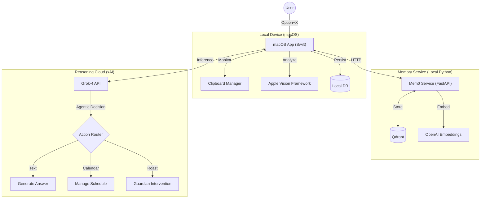

<div align="center">


#  Project Z
### The Memory-Augmented OS Copilot
####  xAI Hackathon 2025 Submission

[](https://x.ai)
[](https://x.ai)
[](https://mem0.ai)
[](https://www.apple.com/macos/)
[](LICENSE)

<br />

**Project Z is the first OS assistant that actually remembers.**  
It combines the reasoning speed of **Grok-4** with the long-term memory of **Mem0** to create a companion that knows your context, protects your social life, and manages your digital workflow.

[View Demo](https://youtu.be/G7C_tThwl9s) · [Report Bug](https://github.com/yhinai/project-z/issues) · [Request Feature](https://github.com/yhinai/project-z/issues)

</div>

---

##  Table of Contents
- [About the Project](#-about-the-project)
- [Key Features](#-key-features)
- [Architecture](#-architecture)
- [Getting Started](#-getting-started)
- [Usage Guide](#-usage-guide)
- [Technology Stack](#-technology-stack)
- [Roadmap](#-roadmap)

---

##  About The Project

Project Z was built to solve a specific problem: **AI assistants are amnesiacs.** They don't know what you copied 5 minutes ago, they don't know your schedule, and they definitely don't know you shouldn't text your ex at 2 AM.

**Project Z changes that.**

By integrating deeply with macOS accessibility and clipboard APIs, and backing it with a persistent vector memory, Project Z acts as a "second brain" that lives on your desktop. It's not just a wrapper; it's an agent that proactively helps you.

---

##  Key Features

###  **Agentic Brain (Grok-4)**
Project Z uses an **Agentic RAG** system to route your queries intelligently.
- **Context Aware:** It knows if you're asking about your clipboard, your calendar, or general knowledge.
- **Fast Reasoning:** Powered by `grok-4-fast` for near-instant responses.

###  **Smart Clipboard**
- **Semantic Search:** Don't remember the exact words? Search by meaning. "The tracking code I copied this morning" finds `1Z999...`.
- **Auto-Tagging:** Every copied item is analyzed and tagged by AI (e.g., `["code", "swift", "networking"]`).
- **Infinite History:** Stored locally and vector-indexed for retrieval.

###  **Guardian Mode**
**Your AI Wingman.** Project Z monitors your screen context.
- **Intervention:** If you open a chat with a "blocked" contact (configured in settings), Z wakes up.
- **Savage Roasts:** It generates a funny, savage roast to stop you from making a mistake.
- **Supported Apps:** Messages, WhatsApp, Telegram, Signal.
> *"Bestie, put the phone down. He's not worth the therapy bills. 🚩"*

###  **Rizz Mode**
Struggling with a reply on a dating app?
- **Context Analysis:** Reads the chat history on your screen.
- **Suggestion Engine:** Generates 4 distinct reply options (Playful, Direct, Mysterious, Casual).
- **Anti-Cringe:** Fine-tuned to avoid generic AI-sounding responses.

###  **Vision Intelligence**
- **Screen Reading:** Press `Option+V` to have Z analyze your current window.
- **OCR:** Extract text from images, videos, or protected websites instantly.

---

##  Architecture

We use a **Hybrid Architecture** to ensure speed and privacy.



---

##  Getting Started

### Prerequisites

*   **macOS 15.0+** (Sequoia) - Required for latest SwiftUI/SwiftData features.
*   **Xcode 16.0+** - To build the Swift project.
*   **Python 3.10+** - To run the memory backend.
*   **API Keys**:
    *   **xAI API Key** (for Grok)
    *   **OpenAI API Key** (for Mem0 embeddings)

### Installation

#### 1. Backend Setup (Memory Service)
The memory service runs locally to keep your data secure and fast.

```bash
# Clone the repository
git clone https://github.com/yhinai/project-z.git
cd project-z/mem0_service

# Install dependencies
pip install -r requirements.txt

# Configure Environment
echo "OPENAI_API_KEY=your_openai_key_here" > .env

# Start the Service
python main.py
```
*You should see: `🚀 Starting Mem0 Service on http://localhost:8420`*

#### 2. iOS/macOS App Setup
1.  Open `Clippy.xcodeproj` in Xcode.
2.  Navigate to **ProjectZApp.swift** or run the app to access **Settings**.
3.  Enter your **xAI API Key**.
4.  Build and Run (`Cmd+R`).
5.  **Important:** Grant **Accessibility** and **Screen Recording** permissions when prompted. These are required for Clipboard monitoring and Guardian Mode.

---

##  Usage Guide

### Keyboard Shortcuts

| Shortcut | Function | Description |
|:---:|:---|:---|
| **`⌥ + X`** | **Talk / Ask** | Opens the main chat interface. Ask about your clipboard, schedule, or general questions. |
| **`⌥ + V`** | **Vision Mode** | Captures the active window/screen and extracts text or context for analysis. |
| **`⌥ + Space`** | **Voice Mode** | *Experimental* - Trigger voice capture to talk to Project Z directly. |
| **`Cmd + Shift + K`** | **Spotlight** | Opens the quick-search history view (Semantic Search). |
| **`Ctrl + Return`** | **Rizz Mode** | **Context Aware:** Analyzes the chat you are looking at and generates 4 reply options. |
| **`Shift + Esc`** | **Privacy Toggle** | Instantly toggles "Incognito Mode" (stops recording clipboard/screen). |
| **`Esc`** | **Dismiss** | Hides the assistant immediately. |

### Rizz Mode Controls
*While Rizz Mode is active:*
*   **`↑` / `↓` Arrow Keys:** Cycle through generated reply options.
*   **`Enter`:** Commit selected reply (pastes into text field).
*   **`Esc`:** Cancel Rizz Mode.

### Example Queries
*   *"What was that code snippet I copied about Python lists?"*
*   *"Do I have any meetings before 2 PM tomorrow?"*
*   *"Schedule a sync with the design team for Friday at 10 AM."*
*   *"Does this email look passive-aggressive? (while looking at an email)"*

---

##  Technology Stack

### **macOS Client**
*   **Language:** Swift 6
*   **UI Framework:** SwiftUI
*   **Database:** SwiftData (Structured), VecturaKit (Local Vector Cache)
*   **OS Integration:** Accessibility API, ScreenCaptureKit, Vision Framework

### **Backend Service**
*   **Framework:** FastAPI (Python)
*   **Memory Engine:** Mem0
*   **Vector DB:** Qdrant (Local Docker/File)
*   **Embeddings:** OpenAI `text-embedding-3-small`

### **AI Models**
*   **Reasoning:** xAI `grok-4-fast` (via API)
*   **Embeddings:** OpenAI (via Mem0)

---

##  Roadmap

- [x] **Core Clipboard Engine**
- [x] **Grok-4 Integration**
- [x] **Mem0 Long-term Memory**
- [x] **Guardian Mode (Screen Context)**
- [ ] **Voice Interface (Speech-to-Text)**
- [ ] **Local LLM Fallback (MLX)**
- [ ] **HomeKit Integration**

---

##  License

Distributed under the MIT License. See `LICENSE` for more information.

---

<div align="center">

**Built with ❤️ for the xAI Hackathon 2025**  
*The future of OS interaction is Agentic.*

<a href="https://x.ai">

</a>

</div>
